# Try-Hack-Me-Lian-Yu
This flag confirms that initial access was successfully achieved. It is usually located in the home directory of the compromised user and demonstrates:  Successful credential discovery Valid system access via SSH

## Overview
Platform: TryHackMe

Room: Lian Yu

Difficulty: Easy–Medium

Objective: Gain user and root access


### Methodology
1. Reconnaissance (Nmap)
 
2. Enumeration (Web + Files)
   
3. Initial Access
  
4. Privilege Escalation


 ## 1. Reconnaissance
Nmap Scan

```bash
nmap -sV -sC -Pn -vv 10.48.158.92
```

Find Open Port Available:

Which is:
1. Port 21 ftp
2. Port 22 ssh
3. Port 80 http
4. Port 111 rcpbind
   
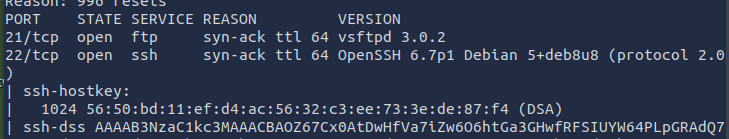
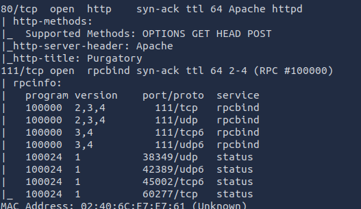

## 2. Web Enumeration
Access Website
Open browser → http://10.48.158.92


Found a basic webpage (island theme / Arrow reference)

Directory Brute Force

```bash
gobuster dir -u http://10.48.158.92 -w /usr/share/wordlists/dirbuster/directory-list-lowercase-2.3-medium.txt
```
Discovered:
/island

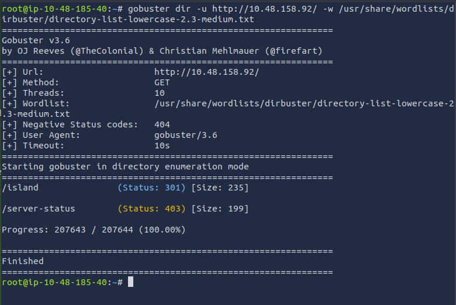

And then open the browser  → http://10.48.158.92/island

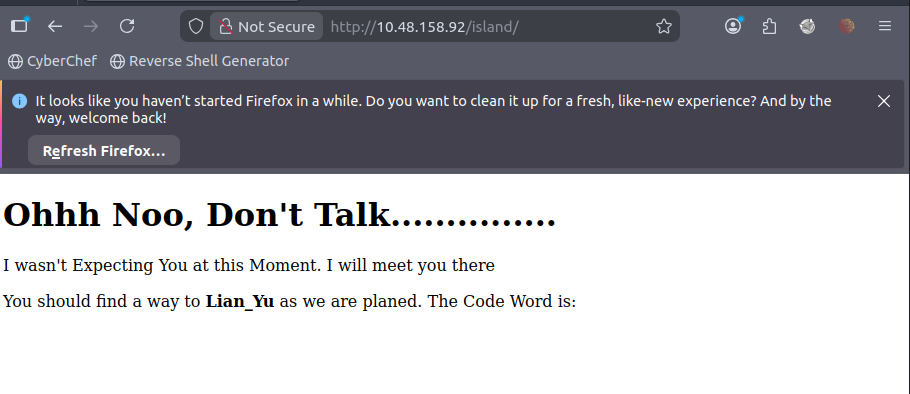

I Forgot to ScreenShot it, Actually if you view the page source you will get the code which is 'vigilante' 

/island/2100

```bash
gobuster dir -u http://10.48.158.92/island -w /usr/share/wordlists/dirbuster/directory-list-lowercase-2.3-medium.txt 
```

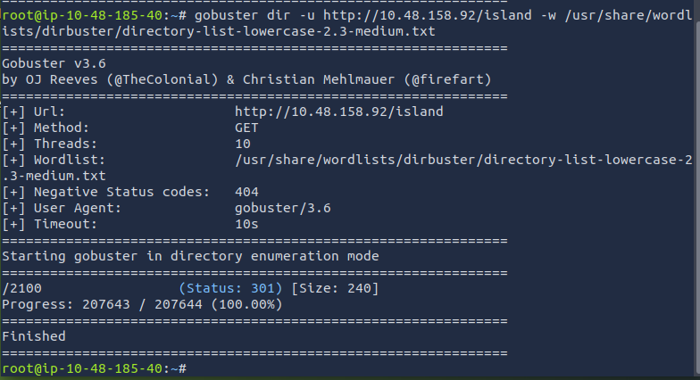

And then open the browser  → http://10.48.158.92/island/2100

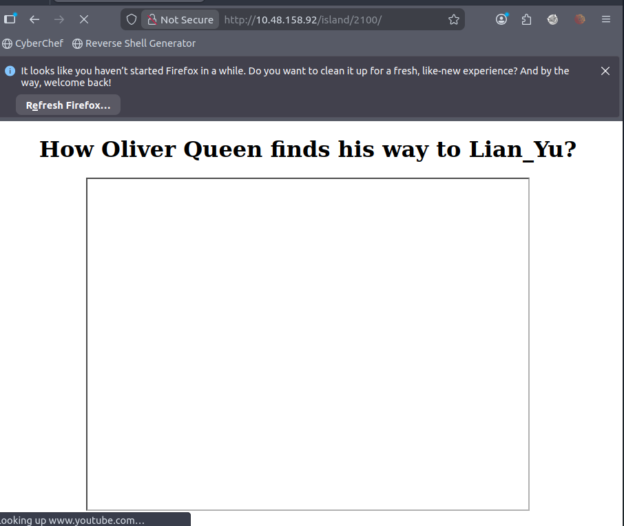

View the page source we found a clue: 

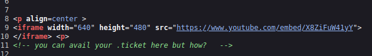

.ticket
Using -x (Extension for the .ticket)

```bash
gobuster dir -u http://10.48.158.92/island/2100 -w /usr/share/wordlists/dirbuster/directory-list-lowercase-2.3-medium.txt -x .ticket
```


Hidden directories with encoded hints:

/green_arrow.ticket


Clue Analysis

Found Base58 encoded strings
Decoded using Cyberchef :


```bash
!#th3h00d
```
Username: vigilante
Possible password hints : !#th3h00d


## 3. Initial Access

Login / SSH

```bash
ssh vigilante@10.48.158.92
```

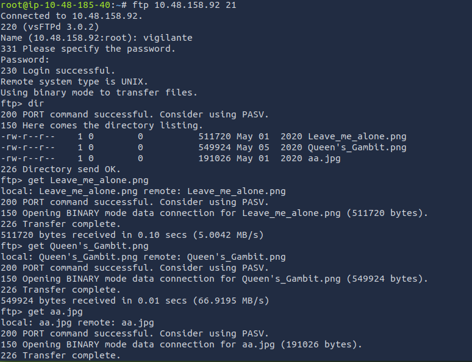

We found 3 images in the Directory:

1. Leabve_me_alone.png
2. Queen's_Gambit.png
3. aa.jpg

Using get to download all the pictures :

```bash
get <<images name>>
```

But only Leave_me_alone.png cannot be open:


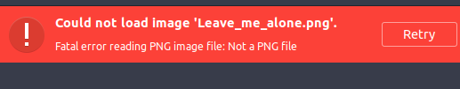

So we use tools Hexeditor to see what wrong with the picture header:

Actually its a wrong header but i forgot to screenshot and we changed it to the the right one:

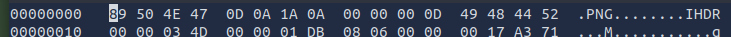 

How do we now what the right one? we search it the photo extension magic number:

 

After that we can successfully open the Leave_me_alone.png

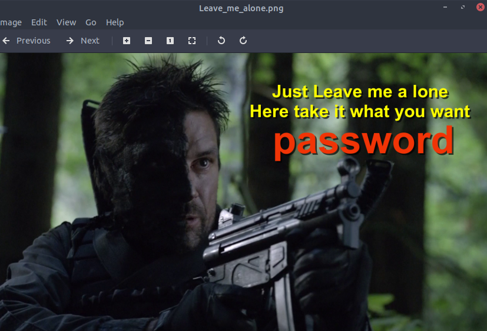 

The picture give a clue with a text : password

Use steghide tool to find if the picture have something behind and we found it at aa.jpg

Used decoded credentials : password

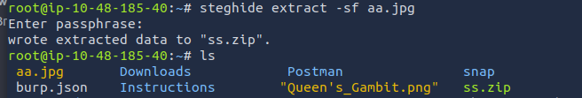 

Successfully extract ss.zip file

There is 2 file:

1. passwd.txt
2. shado

Open the passwd.txt :

 

Just a note saying Visa to landing at the Lian_Yu

Open the shado: 

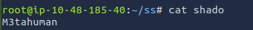 

Code : M3tahuman

After using : cd.. we found there is other user name slade 

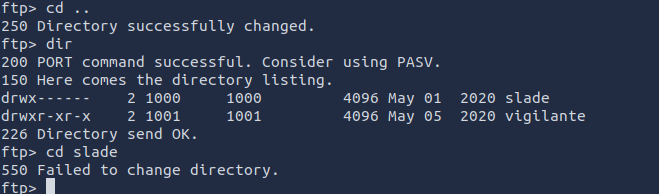 

Using the Code just now login ssh slade

```bash
ssh vigilante@10.48.158.92
```

 

Successfully Login to Slade. 


 ## 4. User Flag

```bash
ls-la
```
found a file name : user.txt

Open it using :

```bash
cat user.txt
```

✅ User flag obtained

```bash
THM{P30P7E_K33P_53CRET5__C0MPUT3R5_D0N'T}
```

##  5. Privilege Escalation

Check Sudo Permissions
sudo -l

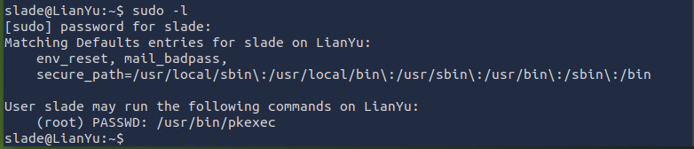 

Found binary allowed to run as root

 

Exploit Using Binary

```bash
sudo pkexec /bin/sh
```

## 6. Root Access

whoami

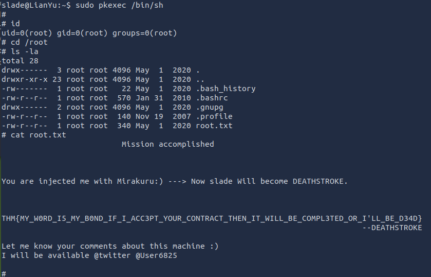 

Output:

root
Get Root Flag
cat root.txt

✅ Root flag obtained

```bash
THM{MY_W0RD_I5_MY_B0ND_IF_I_ACC3PT_YOUR_CONTRACT_THEN_IT_WILL_BE_COMPL3TED_OR_I'LL_BE_D34D}
```


## Key Takeaways
Always enumerate hidden directories
Encoding (Base64,58.,etc) is commonly used in CTF hints
SUID binaries are critical for privilege escalation
GTFOBins is extremely useful

## Tools Used
Nmap
Gobuster
Base58
SSH
GTFOBins
